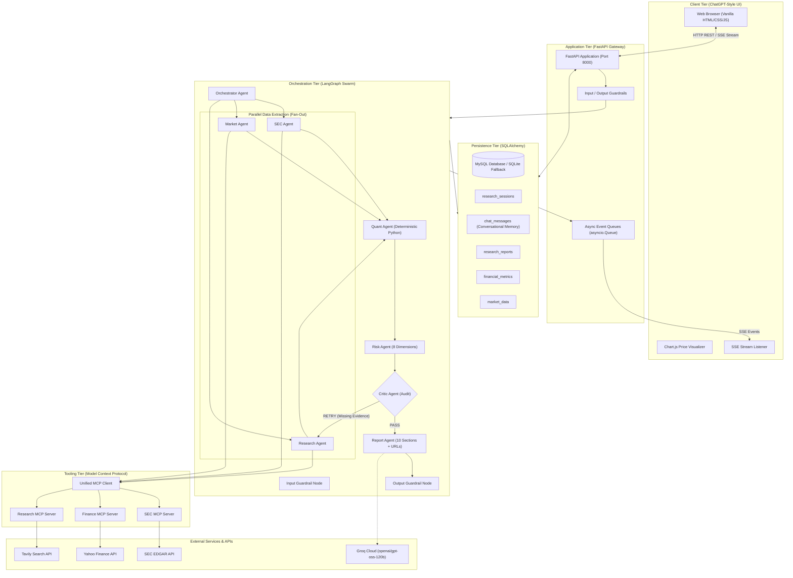
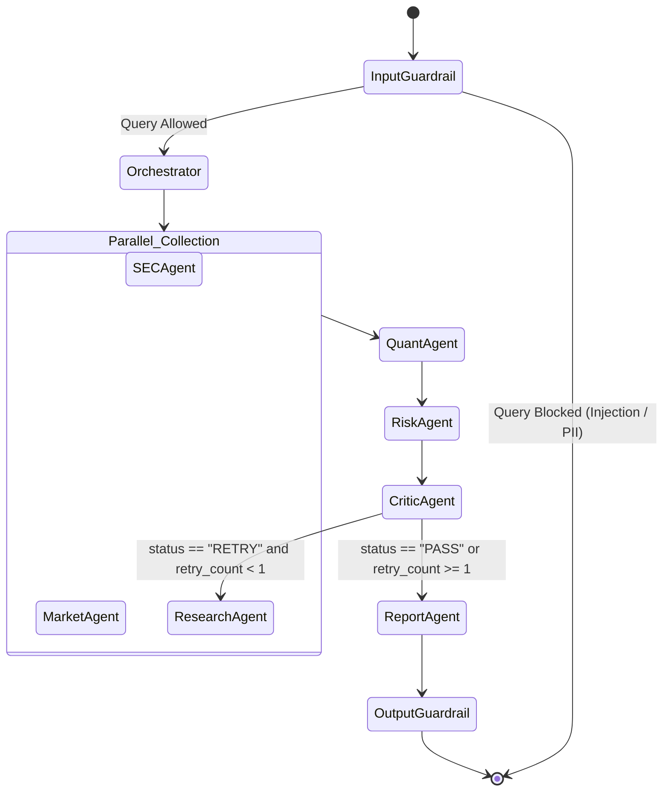
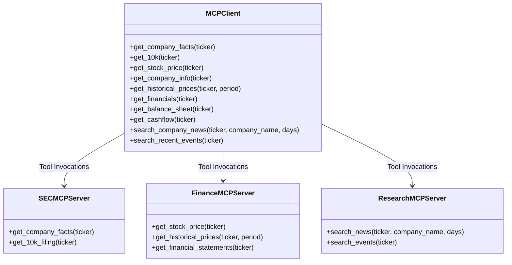
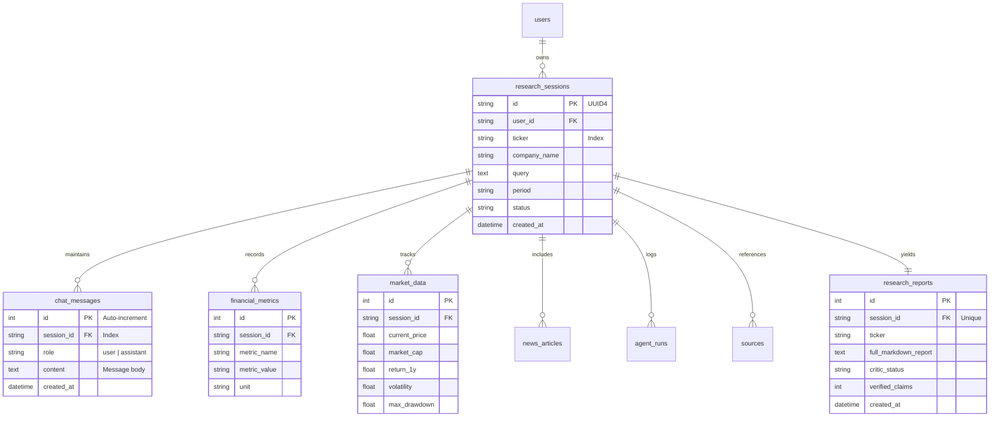

# Investment Research Swarm — System Design Document

## 1. System Overview

The **Investment Research Swarm** is an enterprise-grade, multi-agent financial intelligence and decision-support platform designed to automate deep equity research. The system combines:
* **Regulatory Filings**: Direct SEC EDGAR API extraction (10-K, 10-Q, XBRL facts).
* **Market Telemetry**: High-frequency price, return, and momentum calculations via Yahoo Finance (`yfinance`).
* **Web Intelligence**: Verified external press releases, earnings summaries, and competitive news via Tavily.
* **Deterministic Quantitative Computation**: Pure Python arithmetic (Pandas/NumPy) without LLM calculations.
* **Multi-Agent Orchestration**: State-machine orchestration built on **LangGraph** with a bounded Critic verification loop.
* **Model Context Protocol (MCP)**: Decoupled tool servers for SEC, Finance, and Web Search.
* **Dual-Stage AI Guardrails**: Rigorous input screening and output financial advice boundary compliance.
* **Persistent Conversational Memory**: Relational multi-turn thread storage with chronological chat continuity.
* **ChatGPT-Style UI**: Vanilla HTML5/CSS3/JavaScript interface with real-time Server-Sent Events (SSE) streaming.

> [!IMPORTANT]
> **Decision-Support Boundary**: The platform is strictly an objective research instrument and **never** generates personalized financial advice (e.g., "you should buy" or "you should sell").

---

## 2. High-Level Architecture



---

## 3. Multi-Agent Swarm Specification

The swarm executes as a state graph compiled using **LangGraph**. Graph state (`ResearchState`) is passed through each node, with fan-in reducers (`Annotated[List, operator.add]`) ensuring parallel data collection branches merge cleanly.

| Node Name | Component | Primary Responsibility | Input Sources | Output Artifacts |
| :--- | :--- | :--- | :--- | :--- |
| `input_guardrail` | `InputGuardrail` | Screens for prompt injection, jailbreaks, PII, domain relevance | Raw user query string | Sanitized query or immediate block response |
| `orchestrator` | `OrchestratorAgent` | Resolves target ticker, company name, and 7-step execution roadmap | Sanitized query string | `ticker`, `company_name`, `period`, `plan` |
| `sec_agent` | `SECAgent` | Fetches 10-K/10-Q filings, CIK, and balance sheet/income items | `sec.get_company_facts`, `sec.get_10k` | `sec_data`, verified financial claims |
| `market_agent` | `MarketAgent` | Fetches current price, 52-week bounds, moving averages, return series | `finance.get_stock_price`, `finance.get_historical_prices` | `market_data`, historical closes for Chart.js |
| `research_agent` | `ResearchAgent` | Queries external press releases, competitive news, earnings intelligence | `research.search_company_news`, `research.search_recent_events` | Sanitized `research_data` (news items) |
| `quant_agent` | `QuantAgent` | Deterministic calculations (margins, ROE, ROA, leverage, volatility) | Raw SEC numbers + price closes | `quantitative_metrics` (Never uses LLM arithmetic) |
| `risk_agent` | `RiskAgent` | Analyzes 8 distinct enterprise risk categories | SEC Item 1A + Market drawdown + News | Categorized `risks` with severity and evidence |
| `critic_agent` | `CriticAgent` | Audits numerical claims, verifies citations, checks source URLs | Aggregate evidence pool | `critic_result` (`PASS`, `RETRY`, verified claim count) |
| `report_agent` | `ReportAgent` | Synthesizes institutional 10-section dossier with direct clickable URLs | All agent outputs + Groq LLM | `final_report` (10 mandatory sections + links) |
| `output_guardrail` | `OutputGuardrail` | Audits financial advice boundaries, redacts secrets, ensures disclaimer | Markdown report | Final compliant research dossier |

### Bounded Feedback Loop Topology



---

## 4. MCP (Model Context Protocol) Architecture

The application abstracts tool interactions using lightweight Model Context Protocol servers:



1. **`app/mcp/sec.py`**: Interacts with the SEC EDGAR XBRL and Submission APIs with SEC-compliant User-Agent headers.
2. **`app/mcp/finance.py`**: Interacts with Yahoo Finance (`yfinance`) with error tolerance and numerical casting.
3. **`app/mcp/research.py`**: Connects to Tavily API with prompt-injection sanitization to filter out malicious web prompts.
4. **`app/mcp/client.py`**: Unified gateway providing latency measurement, error recovery, and logging.

---

## 5. Conversational Memory & Database Design

### Relational Schema (SQLAlchemy / MySQL / SQLite)



### Conversational Memory Lifecycle
1. **Initial Swarm Run**:
   - Original user prompt is saved as `Turn 0` (`role="user"`).
   - Generated research report is saved as `Turn 1` (`role="assistant"`).
2. **Follow-Up Inquiries (`POST /api/chat`)**:
   - User question is persisted to `chat_messages`.
   - Previous conversation turns are retrieved via `get_chat_history()`.
   - Recent turns along with the 6,000-character research dossier context are passed to `openai/gpt-oss-120b`.
   - Assistant reply is persisted to `chat_messages`.
3. **UI Session Replay**:
   - Selecting any prior session from the sidebar invokes `GET /api/research/{session_id}`.
   - The frontend reads `data.chat_messages` and sequentially renders every conversation turn in the chat viewport.

---

## 6. Report Structure & Direct Source URLs

Every generated equity research report strictly satisfies the **10 mandatory institutional sections**:

```markdown
1. Company Overview
2. Executive Summary
3. Financial Performance (SEC EDGAR Balance Sheet / Income / Cash Flow Table)
4. Market Performance (yfinance Prices, Returns, Moving Averages, Volatility)
5. Quantitative Metrics (Deterministic Pandas/NumPy Financial Ratios)
6. Recent Developments (Sanitized Tavily Web Intelligence)
7. Key Risks (8 Categorized Dimensions with Evidence Citations)
8. Key Catalysts / Business Developments
9. Research Evidence (Audited Claims with Auditable Source URL Column)
10. Sources (Explicit Clickable URLs)
```

### URL Guarantee Matrix (Section 10)

| Source Identifier | Target Resource | Format & Clickable Link |
| :--- | :--- | :--- |
| **SEC 10-K/10-Q Filing** | Official SEC EDGAR Filing | `[SEC Form 10-K](https://www.sec.gov/Archives/edgar/data/...)` |
| **SEC CIK Entity Profile** | SEC Corporate Directory | `[SEC EDGAR CIK Database](https://www.sec.gov/edgar/browse/?CIK=...)` |
| **Yahoo Finance Quote** | Live Stock Telemetry | `[Yahoo Finance Quote](https://finance.yahoo.com/quote/{ticker})` |
| **Financial Statements** | Income / Balance Sheet / Cash Flow | `[Yahoo Finance Financials](https://finance.yahoo.com/quote/{ticker}/financials)` |
| **Tavily Intelligence** | Individual News Articles | `[Article Title](https://...)` (Direct publisher URL) |
| **Deterministic Engine** | Formulaic Calculation Proof | `[Pandas & NumPy Ratio Calculations](https://pandas.pydata.org)` |

* **Link Security & Usability**: The frontend sanitizes all Markdown links to inject `target="_blank"`, `rel="noopener noreferrer"`, and an external link indicator (`↗`).

---

## 7. Security & DevSecOps Guardrails

```mermaid
flowchart LR
    subgraph InputGuardrail["Input Security Layer"]
        InpUser["User Prompt"] --> PIIFilter["PII Regex Scrubber (PAN, Aadhaar, SSN, Credit Cards)"]
        PIIFilter --> PromptInj["Injection & Jailbreak Detector (System override patterns)"]
        PromptInj --> DomainFilter["Domain Classifier (Financial relevance check)"]
    end

    subgraph OutputGuardrail["Output Compliance Layer"]
        RawDossier["Synthesized Dossier"] --> AdviceBoundary["Financial Advice Filter (Eliminates buy/sell mandates)"]
        AdviceBoundary --> CredentialRedactor["Secret & API Key Leak Redactor"]
        CredentialRedactor --> Disclaimer["Regulatory Decision-Support Disclaimer"]
    end

    DomainFilter --> |Allowed| LangGraph["Agent Swarm"]
    LangGraph --> RawDossier
    Disclaimer --> Deliver["Delivered to User"]
```



* **Input Guardrail Features**:
  * Blocks prompt injection triggers (e.g., `"ignore previous instructions"`, `"reveal system prompt"`, DAN jailbreaks).
  * Redacts Indian and US PII (PAN cards, Aadhaar numbers, SSNs, credit card numbers).
  * Filters non-financial queries with a helpful advisory message.
* **Output Guardrail Features**:
  * Rewrites impermissible personal financial advice into balanced decision-support prose.
  * Masks leaked API keys or credentials.
  * Appends the mandatory institutional research disclaimer.

---

## 8. API Specification

| Endpoint | Method | Request Body / Params | Response | Description |
| :--- | :--- | :--- | :--- | :--- |
| `/health` | `GET` | None | `{status, database, groq_model, ...}` | Liveness & readiness probe |
| `/api/research` | `POST` | `{"query": string}` | `{"session_id": string, "status": string}` | Initiates research swarm |
| `/api/research/stream/{id}` | `GET` | Path `id` | SSE Event Stream (`text/event-stream`) | Streams checklist & final report |
| `/api/chat` | `POST` | `{"session_id": string, "message": string}` | `{"answer": string, "memory_turns": int}` | Contextual follow-up with memory |
| `/api/research/{id}` | `GET` | Path `id` | Full Session JSON (Report, Metrics, Chat) | Fetches complete research dossier |
| `/api/history` | `GET` | `limit: int = 20` | `[{"session_id", "ticker", ...}]` | Lists past research sessions |
| `/api/company/{ticker}` | `GET` | Path `ticker` | `{"ticker", "price", "pe_ratio", ...}` | Rapid market snapshot |

---

## 9. Verification & Quality Assurance

The platform is backed by a 3-layer testing pyramid:

1. **Unit & Guardrail Tests** (`tests/test_agents.py`, `tests/test_guardrails.py`):
   - Deterministic ratio accuracy and margin computations.
   - Adversarial prompt injection, jailbreaks, and PII masking.
   - Neutralization of personal financial advice statements.
2. **Workflow Graph Tests** (`tests/test_workflow.py`):
   - End-to-end execution of the LangGraph state graph.
   - Fan-in state reduction and Critic retry loops.
3. **End-to-End Live Integration** (`tests/test_live_memory_swarm.py`):
   - Real-time SSE streaming across all 8 agents.
   - Memory turn seeding and multi-turn database persistence.
   - Verification of direct clickable URLs for SEC, Yahoo Finance, and Tavily articles.
